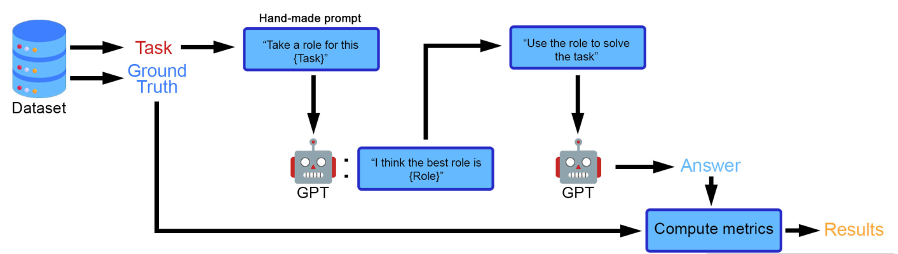

# Self-Role Prompting for Zero-Shot Reasoning

This repository contains an experimental implementation of **Self-Role Prompting**, a zero-shot reasoning strategy where an LLM first selects the role it should assume for a task, then solves the task using that self-selected role.

The project extends the idea behind **Role-Play Prompting** by removing the need to manually design a role for each dataset or task type. Instead of hard-coding prompts such as "Math Professor" or "Expert Strategist", the model is asked to infer an appropriate role from the task itself.

This work builds on the original Role-Play Prompting paper and codebase:

- Original repo: [NKU-HLT/Role-Play-Prompting](https://github.com/NKU-HLT/Role-Play-Prompting)
- Original paper: **Better Zero-Shot Reasoning with Role-Play Prompting**
- Original authors: Aobo Kong, Shiwan Zhao, Hao Chen, Qicheng Li, Yong Qin, Ruiqi Sun, and Xin Zhou

## Motivation

Large language models show strong reasoning ability, but their zero-shot performance can suffer when the prompt is generic and task-agnostic. Prior work shows that assigning an explicit role can improve reasoning, but manually crafting roles does not scale well across datasets, domains, or task types.

Self-Role Prompting asks a simple question: **can the LLM choose its own useful role before solving the task?**

The goal is to bridge two useful properties:

- The flexibility of role-specific prompting.
- The scalability of zero-shot prompting without manual role engineering.

## Method

The method turns each task into a short multi-turn interaction:

1. **Role selection prompt**  
   The model receives the task and is instructed to choose the best role for solving it, without answering the task yet.

2. **Role description response**  
   The model describes the role it will assume.

3. **Task resolution prompt**  
   The model receives the original task again and is asked to solve it using the selected role.

4. **Final response and evaluation**  
   The model answer is parsed and compared with the ground-truth answer.

Example conversation structure:

```text
User: Choose the best role for the following question or task: [TASK].
      Answer with the role you will take, not with the answer.

Assistant: Based on the task, the best role is ... [ROLE DESCRIPTION].

User: Now using that role, answer the following question/task: [TASK].

Assistant: [ANSWER]
```



## Experiments

The experiments evaluate arithmetic and commonsense reasoning tasks:

| Category | Dataset | Purpose |
|---|---|---|
| Arithmetic reasoning | AQUA-RAT | Multi-step algebraic word problems with multiple-choice answers |
| Commonsense reasoning | CSQA / CommonsenseQA | Questions requiring everyday commonsense knowledge |
| Strategic reasoning | StrategyQA | Questions requiring implicit, multi-hop or strategic reasoning |

The model used in the paper draft was `gpt-3.5-turbo` with temperature `0`.

Baselines:

- Zero-Shot
- Zero-Shot-CoT
- Few-Shot-CoT
- Static Role-Play Prompting with manually crafted roles
- Self-Role Prompting

For CSQA and StrategyQA, the reported experiments used a randomly sampled 50% subset of the test set due to API and compute constraints.

## Results

Accuracy comparison reported in `reports/adaptive_role_selection_icml2025.pdf`:

| Method | AQUA | CSQA | StrategyQA |
|---|---:|---:|---:|
| Zero-Shot | 53.5 | 74.5* | 66.0* |
| Zero-Shot-CoT | 53.9 | 68.8* | 65.8* |
| Few-Shot-CoT | 59.4 | 76.3* | 67.4* |
| Static Role-Play Prompting | **63.8** | **77.2*** | 67.0* |
| Self-Role | 59.5 | 74.0* | **70.4*** |

`*` indicates that 50% of the test dataset was used.

Key takeaways:

- On **AQUA-RAT**, Self-Role reaches 59.5%, matching Few-Shot-CoT and outperforming Zero-Shot / Zero-Shot-CoT, while not requiring few-shot examples.
- On **CSQA**, Self-Role is competitive but below Few-Shot-CoT and static Role-Play, suggesting that manual role design can still help on some commonsense tasks.
- On **StrategyQA**, Self-Role achieves the best result, 70.4%, suggesting that dynamic role selection is especially useful for nuanced or strategic reasoning.


## Why It Matters

The method is most interesting when manual prompt engineering becomes a bottleneck. A static role can work well when the task type is known in advance, but adaptive role selection gives the model a chance to choose task-specific reasoning behavior automatically.

This makes the approach appealing for:

- Scalable prompt engineering.
- Automated reasoning pipelines.
- Task routing and self-conditioning.
- LLM evaluation across heterogeneous datasets.

## Repository Structure

```text
.
|-- dataset/                         # Public benchmark datasets used by the original repo
|-- assets/                          # README figures
|-- reports/                         # Paper draft and project report
|-- create_dataset_for_symbolic_reasoning.py
|-- main.py                          # Experiment entry point
|-- run.sh                           # Example shell runner
|-- utils.py                         # Dataset loading, decoding and answer parsing
|-- requirements.txt
`-- README.md
```

## Tech Stack

- Python
- PyTorch DataLoader utilities
- OpenAI API
- Pandas / NumPy
- Public reasoning datasets: AQUA-RAT, CommonsenseQA, StrategyQA and arithmetic benchmarks

## Installation

```bash
python -m venv .venv
source .venv/bin/activate
pip install -r requirements.txt
```

Set your API key:

```bash
export OPENAI_API_KEY="..."
```

On Windows PowerShell:

```powershell
$env:OPENAI_API_KEY="..."
```

Optional:

```bash
export OPENAI_ORGANIZATION="..."
```

## Usage

Run Self-Role Prompting on AQUA-RAT:

```bash
python main.py --limit_dataset_size=100 --method=adaptive_role_play --model=turbo --dataset=aqua
```

Run static Role-Play:

```bash
python main.py --limit_dataset_size=100 --method=role_play --model=turbo --dataset=aqua
```

Run Zero-Shot:

```bash
python main.py --limit_dataset_size=100 --method=zero_shot --model=turbo --dataset=aqua
```

Available datasets include:

```text
aqua, gsm8k, commonsensqa, addsub, multiarith, strategyqa,
svamp, singleeq, bigbench_date, object_tracking, coin_flip,
last_letters
```

## Notes on Reproducibility

The code sets temperature to `0`, but LLM API outputs may still vary across runs because hosted model backends are not perfectly deterministic. Full reproduction also requires API access and may incur cost.

The current implementation uses the legacy OpenAI Python SDK interface (`openai==0.27.8`) to stay close to the original codebase. A production-quality version should migrate to the current OpenAI SDK and add response caching.

## Limitations

- Full reproduction requires LLM API access.
- API-based experiments may change over time as hosted model versions change.
- CSQA and StrategyQA results were reported on 50% test subsets.
- Adaptive role selection is context-dependent: it performed especially well on StrategyQA but did not beat static Role-Play on AQUA or CSQA.
- The repository still needs a cleaner experiment runner, structured configs and automated result aggregation before being considered fully polished.

## Responsible Use

Improving LLM reasoning can support useful applications such as education, research assistance and complex problem-solving. It can also make misuse easier, including more persuasive misinformation or harmful task automation. This project should be used as an evaluation and research artifact, not as a guarantee of reliable reasoning in high-stakes settings.

## Citation

Original Role-Play Prompting paper:

```bibtex
@misc{kong2023better,
  title={Better Zero-Shot Reasoning with Role-Play Prompting},
  author={Aobo Kong and Shiwan Zhao and Hao Chen and Qicheng Li and Yong Qin and Ruiqi Sun and Xin Zhou},
  year={2023},
  eprint={2308.07702},
  archivePrefix={arXiv},
  primaryClass={cs.CL}
}
```

Related references discussed in the paper draft include Zero-Shot-CoT, Chain-of-Thought prompting, CommonsenseQA, StrategyQA and role-play with large language models.
